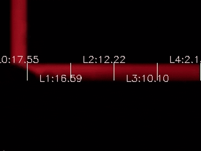
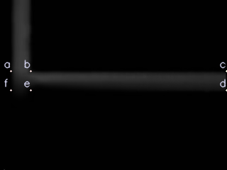
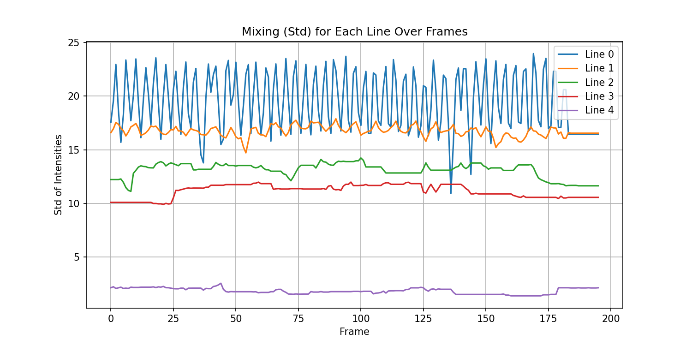

# Microfluidic Light Intensity Measurement

**Project Title:** Microfluidic Light Intensity Measurement  
**Duration:** Jan 2025 - Present  

## Introduction
<p align="center">
  
</p>

**Microfluidic Light Intensity Measurement** is a project showcasing how to analyze and measure fluid mixing in a microfluidic T-form mixer. By applying edge detection, line merging, and intensity sampling techniques, it processes video data to identify key channels and quantify mixing behavior.

The dataset used in this project was originally provided by the authors of [“Microfluidic T-Form Mixer Utilizing Switching Electroosmotic Flow”](https://doi.org/10.1021/ac0494782.s001) (Lin, Che-Hsin; Fu, Lung-Ming; Chien, Yu-Sheng, 2016) and is publicly available through ACS Publications. Through combined computer vision and signal processing methods, this workflow visualizes and assesses the degree of mixing within microfluidic channels, offering insights into electroosmotic flow efficiency.

## Start Guide

### Requirements
- Python 3.8 or above  
- OpenCV (e.g., `opencv-python`)  
- NumPy  
- Matplotlib  

### Installation
1. **Clone the repository**:
    ```bash
    git clone https://github.com/seonghwan97/Microfluidic-Light-Intensity-Analysis.git
    cd Microfluidic-Light-Intensity
    ```

2. **Install dependencies**:
    ```bash
    pip install -r requirements.txt
    ```
    *(Ensure your `requirements.txt` includes all required libraries, e.g., OpenCV, NumPy, Matplotlib, etc.)*

3. **Run the code**:
    ```bash
    python main.py
    ```
    This will process the input video (e.g., `video.mp4` in `./data`) and produce outputs in the `./results` directory.

4. **Parameters**
    You can adjust key parameters in base.py:

    ```N_POINTS```: Number of divisions for each segment (b->c, e->d)  
    ```NUM_SAMPLES```: Number of pixel samples per line segment  

    Modify these values as needed before running the code to change the granularity of the mixing measurement.

---

## Key Features
- **Automated Edge & Line Detection**  
  Uses Canny edge detection and the Probabilistic Hough Transform to identify and merge lines in the microfluidic channel.  
  <p align="center">
  
</p> 

- **Corner Identification**  
  Locates key corners (e.g., in a T-form mixer) and labels them automatically for further region-of-interest extraction.  
  <p align="center">
  
</p>  

- **Intensity-Based Mixing Measurement**  
  Samples pixel intensities $({x_1, x_2, \dots, x_N})$ along user-defined or automatically derived line segments.  
  The standard deviation $(\sigma)$ is computed as follows:

  $$
  \sigma = \sqrt{\frac{1}{N} \sum_{i=1}^{N} \bigl(x_i - \mu\bigr)^2}, 
  \quad 
  \mu = \frac{1}{N}\sum_{i=1}^{N} x_i
  $$

- **Visualization & Annotation**  
  Generates annotated images and an output video highlighting detected lines, corners, and the computed intensity metrics.  
  <p align="center">
  
</p>

- **Time-Series Analysis**  
  Produces time-series plots of intensity variation across frames to track how mixing evolves over the course of the video.
  <p align="center">
  
</p>  

## References

1. Lin, Che-Hsin; Fu, Lung-Ming; Chien, Yu-Sheng. (2016).  
   _Microfluidic T-Form Mixer Utilizing Switching Electroosmotic Flow._  
   [**ACS Publications**](https://doi.org/10.1021/ac0494782.s001)

## Data Source
The sample microfluidic data used in this project is sourced from the following dataset:

> **Lin, Che-Hsin; Fu, Lung-Ming; Chien, Yu-Sheng (2016). Microfluidic T-Form Mixer Utilizing Switching Electroosmotic Flow. ACS Publications. Dataset. [https://doi.org/10.1021/ac0494782.s001](https://doi.org/10.1021/ac0494782.s001)**

You can also find it on [ACS Figshare](https://acs.figshare.com/articles/dataset/Microfluidic_T_Form_Mixer_Utilizing_Switching_Electroosmotic_Flow/3325171?file=5163955), as provided by the original authors. 

---

This README is concise but includes essential sections for an academic project. Feel free to tweak it or add more details specific to your implementation!